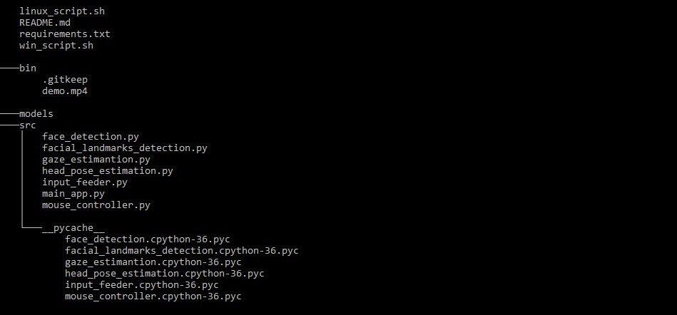

# Computer Pointer Controller
In this application, users can move mouse with his gaze movement. This project is a part of Intel Edge AI for IoT Developers Nanodegree program by Udacity.
##### Project video
[Computer Pointer Controller](https://drive.google.com/file/d/1gR22sikjKrUeftR69YDw1TGiVZy2Ep7j/view?usp=sharing)
### Project Set Up and Installation 
  #### Requirements 
###  Hardware 
-   6th to 10th generation Intel® Core™ processor with Iris® Pro graphics or Intel® HD Graphics.
-   VPU - Intel® Neural Compute Stick 2 (NCS2)
-   FPGA
###  Software 
-   Intel® Distribution of OpenVINO™ toolkit 2019 R3 release [docs](https://software.intel.com/content/www/us/en/develop/tools/openvino-toolkit/choose-download.html)
-   Intel DevCloud
### Model installations
  -   [Face Detection Model](https://docs.openvinotoolkit.org/latest/_models_intel_face_detection_adas_binary_0001_description_face_detection_adas_binary_0001.html)
-   [Facial Landmarks Detection Model](https://docs.openvinotoolkit.org/latest/_models_intel_landmarks_regression_retail_0009_description_landmarks_regression_retail_0009.html)
-   [Head Pose Estimation Model](https://docs.openvinotoolkit.org/latest/_models_intel_head_pose_estimation_adas_0001_description_head_pose_estimation_adas_0001.html)
-   [Gaze Estimation Model](https://docs.openvinotoolkit.org/latest/_models_intel_gaze_estimation_adas_0002_description_gaze_estimation_adas_0002.html)
#### Installation commands
Face detection model
```
python "C:\Program Files (x86)\IntelSWTools\openvino\deployment_tools\tools\model_downloader\downloader.py" --name "face-detection-adas-binary-0001" -o "your directory"\models 
```
Facial landmarks detection model
```
python "C:\Program Files (x86)\IntelSWTools\openvino\deployment_tools\tools\model_downloader\downloader.py" --name "landmarks-regression-retail-0009" -o "your directory"\models
```
Head Pose Estimation Model
```
python "C:\Program Files (x86)\IntelSWTools\openvino\deployment_tools\tools\model_downloader\downloader.py" --name "head-pose-estimation-adas-0001" -o "your directory"\models
```
Gaze Estimation Model
```
python "C:\Program Files (x86)\IntelSWTools\openvino\deployment_tools\tools\model_downloader\downloader.py" --name "gaze-estimation-adas-0002" -o "your directory"\models
```
#### Configuration for Python files 
##### Activate virtualenv
In the directory run: ```pip install -r requirments.txt```
```
virtualenv computerpointercontroller 
```
```
computerpointercontroller\Scripts\activate 
```   
## Running the App
#### App directory structure


#### For Windows
#####  Initialize OpenVINO Environment
``` 
cd C:\Program Files (x86)\IntelSWTools\openvino\bin\ 
```
```
setupvars.bat
```
```

python src/app.py -fdm models/intel/face-detection-adas-binary-0001/INT1/face-detection-adas-binary-0001 -flm models/intel/landmarks-regression-retail-0009/FP32/landmarks-regression-retail-0009 -hpm models/intel/head-pose-estimation-adas-0001/FP32/head-pose-estimation-adas-0001 -gm models/intel/gaze-estimation-adas-0002/FP32/gaze-estimation-adas-0002 -i bin/demo.mp4 -extension "{your openvino directory}/deployment_tools/inference_engine/bin/intel64/Release/cpu_extension_avx2.dll" -d CPU -pt 0.4 -flags fdm flm hpm gm

```
or
```

win_script.sh

```

#### For Linux

```
source ~/envs/computerpointercontroller/bin/activate
```
```
source /opt/intel/openvino/bin/setupvars.sh
```
```
python src/app.py -fdm models/intel/face-detection-adas-binary-0001/INT1/face-detection-adas-binary-0001 -flm models/intel/landmarks-regression-retail-0009/FP32/landmarks-regression-retail-0009 -hpm models/intel/head-pose-estimation-adas-0001/FP32/head-pose-estimation-adas-0001 -gm models/intel/gaze-estimation-adas-0002/FP32/gaze-estimation-adas-0002 -i bin/demo.mp4 -extension "/opt/intel/openvino/deployment_tools/inference_engine/lib/intel64/libcpu_extension_sse4.so" -d CPU -pt 0.4 -flags fdm flm hpm gm
```
or
```

linux_script.sh

```
## Documentation for running command
- -fdm for face detection mode
- -flm for landmarks regression retail
- -hpm for head-pose estimation model
- -gm for gaze estimation model
- -i is for input file (picture, video and cam)
- -extension for cpu extension which is needed for unsupported layers
- -d device type (CPU, GPU, VPU, FPGA)
- For more information you can run ```python src/app.py --help```
## Benchmarks  
| Perofrmance	(ms)								| 	INT8|					FP16 | 		FP32 |
| -----------------------------------         |:---------------------------------:| :-------:| :-------:| 
| Inference Time		         				| 97.700 ms				 |96.400 ms | 97.800 ms		 |
| FPS      											| 6					| 6 |			5		 |
| Face Detection model load time         		 | 519.999 ms			| 495.996 ms|	 529.005 ms	 |
| Facial Landmarks model load time 			 | 129.007 ms 				| 120.997 ms|	 118.998 ms	 	|			
| Head Pose Estimation model load time	     | 148.000 ms 					| 157 ms  | 147.002 ms	 	|
| Gaze Estimation model load time	  		  | 214.004 ms		 	|  201.997 ms |	  	202.993 ms	|
|Total									   | 	1011.011 ms				 |  975.990 ms	 |	997.999 ms |

## Results 
In conclusion, we can see performace is same in all models because I used 3rd generation Intel i3 CPU for this project but total model loading time and inference time with FP16 model is quicker than other models
  

## Stand Out Suggestions

In app, `get_perf_counts` API  is used for printing the time of the each layer in the models

  

### Async Inference
In app, I used async method in all models but it deos not affect app performance due to 3rd gen CPU
  

### Edge Cases
Sometimes mouse move opposite, app does not run as exptected